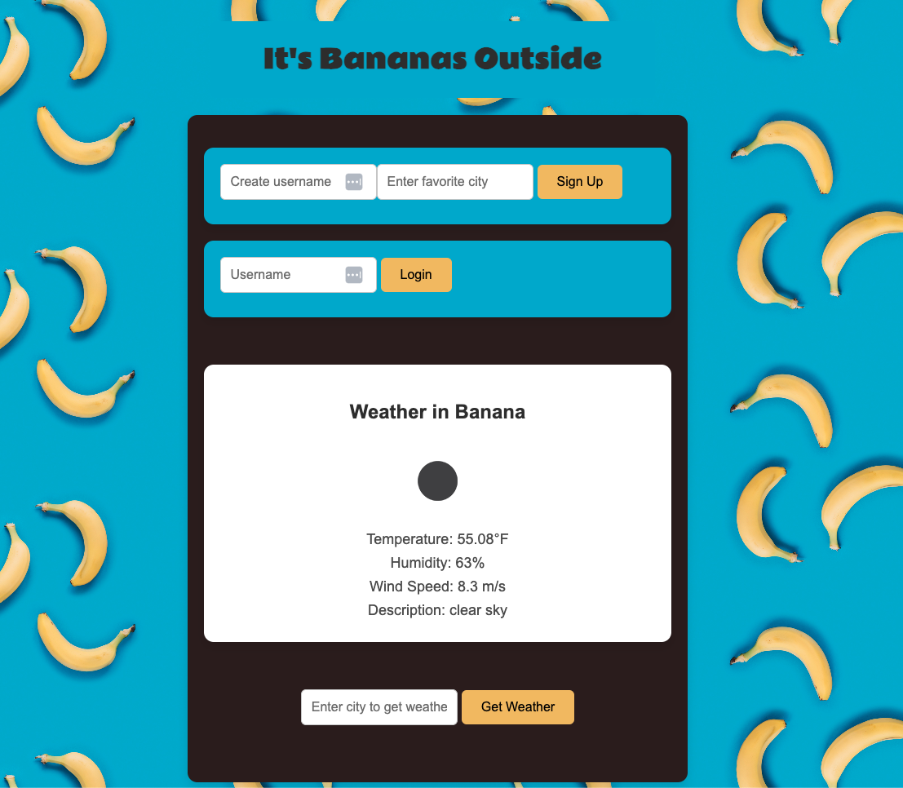

# Weather App 2.0 "Its Bananas Outside"

A full-stack weather app built with React for the frontend and Node/Express.js for the backend. The app integrates with the OpenWeatherMap API to fetch and display weather data based on user input. Now with added functionality to store user data, user login, sign-up functionality, and enhanced backend error handling with robust error messages.

## Table of Contents

1. [Overview](#overview)
2. [What's New](#whats-new)
3. [Features](#features)
4. [Demo](#demo)
5. [Installation](#installation)
6. [Usage](#usage)
7. [Technologies Used](#technologies-used)
8. [Contributing](#contributing)
9. [License](#license)

## Overview

The Weather App allows users to search for the current weather information of any city and save their favorite city after logging in. The app fetches data from the OpenWeatherMap API and displays the city’s weather, temperature, humidity, wind speed, and an icon representing the weather condition. Users can sign up, log in, save their favorite city, and update it as needed. This app demonstrates full-stack development with a React frontend, Express.js backend, and PostgreSQL database.

## What's New

### Major Updates
 
 - Added Database Integration: The app now integrates with PostgreSQL to store user data. This allows users to sign up, log in, and save or update their favorite city.
 - User Login: Users can now sign up for new accounts and log in with an existing username. Favorite cities are stored per user.
 - Favorite City Management: Users can save their favorite city after logging in. They can update their favorite city by searching for a new one.
 - Enhanced Styling: The user interface has been improved with more polished and responsive styling to enhance the overall user experience across devices.
 - More Robust Error Handling: Backend error handling has been significantly improved. Now, detailed error messages are shown to developers for issues with request and server errors.

## Features

- Search for Weather: Users can search for weather information by city name.
- User Sign-Up and Login: New users can sign up, and existing users can log in.
- Save and Update Favorite City: Users can save a favorite city and update it if needed.
- Displays Weather Data: Shows current weather conditions, including temperature, humidity, wind speed, and an icon representing the weather.
- Responsive Design: Works on desktops, tablets, and mobile devices.
- Enhanced Error Handling: Robust backend error handling for network issues.

## Version 1.0 Demo


## Version 2.0 Demo



## Installation

Follow these steps to set up the project locally.

### Prerequisites

- Node.js and npm installed on your machine.

### Backend Setup

1. Clone the repository:

  ```bash
   git clone git@github.com:MBHunter88/-techtonica-assignments.git
   
   cd weather-app/server
   ```

2. Install the backend dependencies:

 ```bash
 npm install
 ```

3. Create a .env file in the /server directory and add your OpenWeatherMap API key:

```bash
API_KEY=your_openweathermap_api_key
PORT=8080
DATABASE_URI=your_postgresql_connection_string
```

4. Start the backend server:

```bash
npm start
```

### Frontend Setup

1. Navigate to the frontend directory:

```bash
cd ../client
```

2. Install the frontend dependencies:


```bash
npm install
```

3. Start the React development server:


```bash
npm run dev
```

4. Open your browser and go to local host.

## Usage

1. Search for a City: Enter a city name in the input field and click "Get Weather" to view the current weather information for that city.
2. User Login and Sign-Up:
Sign up as a new user by providing a username and a favorite city.
Log in with an existing username to see or update the favorite city.
3. Save Favorite City: After logging in, search for a city and save it as your favorite using the "Save as Favorite" button.
4. Update Favorite City: If you search for another city, you can update your favorite city.


## Technologies Used
Frontend:

- React.js
- Vite (React app bundler)
- CSS for styling and responsive design

Backend:

- Node.js
- Express.js
- dotenv for environment variables
- cors
- body-parser
- PostgreSQL for database management

API:

- OpenWeatherMap API for weather data

Database

- PostgreSQL: The app uses a PostgreSQL database to store user information, including usernames and favorite cities. The database allows users to sign up, log in, and save or update their favorite city.

## License
This project is licensed under the MIT License - see the LICENSE file for details.