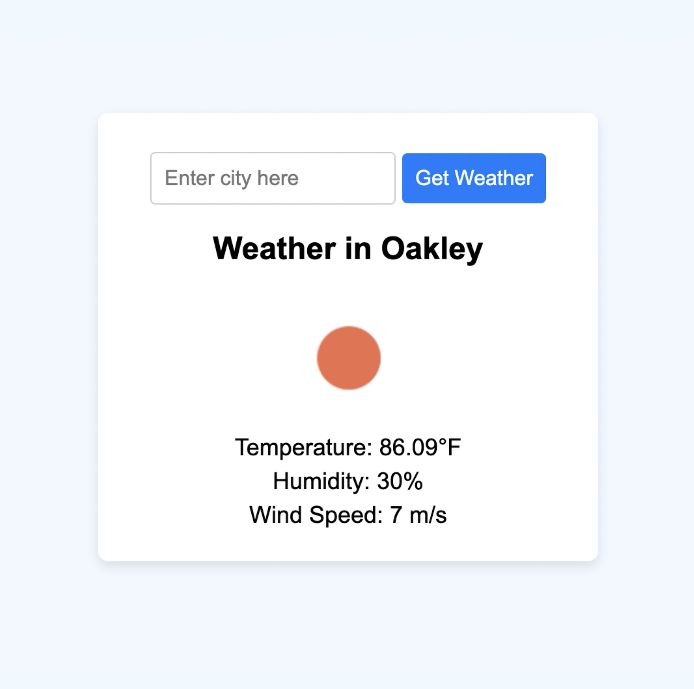

# Weather App

A simple and responsive weather app built using React for the frontend and Node/Express.js for the backend. The app fetches weather data from the OpenWeatherMap API and displays it based on user input.

## Table of Contents

1. [Overview](#overview)
2. [Features](#features)
3. [Demo](#demo)
4. [Installation](#installation)
5. [Usage](#usage)
6. [Technologies Used](#technologies-used)
7. [Contributing](#contributing)
8. [License](#license)

## Overview

The Weather App allows users to search for the current weather information of any city. The app fetches data from the OpenWeatherMap API and displays the city’s weather, temperature, humidity, wind speed, and an icon representing the weather condition. This app demonstrates the integration of a React frontend with an Express.js backend.

## Features

- Search for weather information by city name.
- Displays current weather conditions including temperature, humidity, wind speed, and an icon.
- Responsive design that works on desktops, tablets, and mobile devices.
- Error handling for incorrect city names or network issues.

## Demo




## Installation

Follow these steps to set up the project locally.

### Prerequisites

- Node.js and npm installed on your machine.

### Backend Setup

1. Clone the repository:

  ```bash
   git clone git@github.com:MBHunter88/-techtonica-assignments.git
   
   cd weather-app/server
   ```

2. Install the backend dependencies:

 ```bash
 npm install
 ```

3. Create a .env file in the /server directory and add your OpenWeatherMap API key:

```bash
API_KEY=your_openweathermap_api_key
PORT=8080
```

4. Start the backend server:

```bash
npm start
```

### Frontend Setup

1. Navigate to the frontend directory:

```bash
cd ../client
```

2. Install the frontend dependencies:


```bash
npm install
```

3. Start the React development server:


```bash
npm run dev
```

4. Open your browser and go to local host.

## Usage

1. Search for a City: Enter a city name in the input field and click "Get Weather" to view the current weather information for that city.
2. Default City: The app loads with weather data for "Oakley" as the default city on startup.


## Technologies Used
Frontend:

- React.js
- Vite (React app bundler)
- CSS for styling and responsive design

Backend:

- Node.js
- Express.js
- dotenv for environment variables
- cors
- body-parser

API:

- OpenWeatherMap API for weather data

## License
This project is licensed under the MIT License - see the LICENSE file for details.